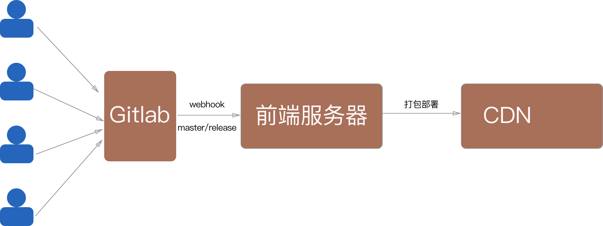

[TOC]

## 前端服务器

### 前端项目正常开发流程

一个完整的前端项目从开发到上线、后期维护的流程如下
- 根据产品原型图确定技术框架，与后端一起讨论接口形式和数据结构。
- 规划开发时间，估出可靠的时间点，踩点开发。
- GitLab初始化项目，确立git flow工作流：主分支`master`、开发分支`dev`、测试分支`release/release**`、功能分支`feature/**`、修复分支`hotfix／**`。
- 开发者从`dev`分支拉出新的功能分支开发，在开发工程中尽量避免`merge`操作。
- 开发者在功能分支上开发完成之后将代码推送到远程仓库并提交合并分支请求：`merge request`，目标分支为`dev`。这时需要指定代码审核人并将合并请求指向此人。
- 代码审核人在收到合并分支请求后，对本次需要合并的代码进行`code review`，这个环节主要是规范代码、排查潜在的bug。代码审核完成后需要审核人打上标记并将合并请求指向测试人员，没有标记不予测试。
- 测试人员接收到合并请求并确认代码审核过之后，合并分支到`dev`分支，并从`dev`分支拉出新的测试分支`release/release**`，推送到远程仓库，前端服务器会自动拉取项目并发布到预发布cdn
- 测试人员预发地址上测试功能，如果测出问题，开发人员可直接在`release`分支上修改并推送到仓库，前端服务器会响应式地发布
- 测试通过之后，测试人员将`release`分支到`master`主分支上，并打上`tag`，同时`dev`分支需要合并`master`分支上的改动，确保每次功能发布之后`dev`分支与`master`分支保持一致
- 前端服务器监听代码仓库`master`分支的变换，自动部署到正式环境

在出现bug需要修复时操作流程如下
- 从最新的`master`分支上检出修复分支`hotfix/fix**`
- 开发者修复bug
- 修复完成后，推送修复分支并提交合并分支请求，目标分支：`dev`,进入代码审核阶段。
- 后面的操作与正常开发流程一致

### 前端服务器构建逻辑

依据前面的项目发布流程，前端服务器的主要作用是监听代码仓库分支的变化，在需要的时候进行打包部署项目，以及自动化测试



**`wenbhook`钩子配置具体可以查看gitlab文档**。

### 前端服务器项目代码说明

项目目录

|\
| +---controller `控制器，处理前端请求`\
| --------repConfigController.js `获取修改仓库的配置`\
| --------repHookController.js `处理hook操作，进行打包部署`\
| +---service `一些底层操作，供控制层调用`\
| --------responseService.js `对http.Response对象的一些操作`\
| --------shellService.js `shell命令集`\
| --------uploadService.js `提供上传需要的类`\
| +---log `仓库日志文件`\
| +---repositories `代码仓库`\
| +---repConifg `存放项目的配置文件`\
| +---static `静态文件目录`\
| ----node_modules\
| ----package.json \
| ----dispatcher.js `分发器（获取请求信息并指定对应的controller处理）`\
| ----server.js `服务器启动文件` \

#### server.js

关键代码：

```javascript
let server = HTTP.createServer()
server.on('request', dispatcher)
server.listen('80')
```

功能：
- 项目启动文件
- 将项目部署到80端口
- 所有请求都交由`dispathcer`分发器处理

#### disptcher.js

处理逻辑：所有的请求都会走dispatcher分发器，通过识别url来动态指定controller处理程序。传递`http.IncomingMessage`和`http.ServerResponse`给controller，响应会在controller结束。

关键代码：

```javascript
/**
 * 事件处理模块
 *
 * 以名称进行匹配，例如upload匹配的地址就是http://[host]/upload/**，**代表具体的处理程序
 */
let handles = {
  hook: repHook,
  repConfig: repConfig
}
// ......
/**
 * get 请求处理
 *
 * @param {http.IncomingMessage} req
 * @param {http.ServerResponse} res
 */
function handleGet (req, res) {
  // 数据获取
  let url = URL.parse(req.url)
  let pathname = url.pathname
  // ......
  if (/^\/static\/[^.]*\.[^\.]*$/.test(pathname)) {
    // 静态资源支持:如/static/**.html格式
	//......
  }else {
    // 非静态资源支持
    // 获得句柄
    let reqHand = pathname.match(/([^\/]+)/g)
    // 获得参数
    let query = url.query
    let func = handles[reqHand[0]]
    func[reqHand[1]](query, req, res)
  }
}
// ......
/**
 * post 请求处理
 *
 * @param {http.IncomingMessage} req
 * @param {http.ServerResponse} res
 */
function handelPost (req, res) {
  let url = URL.parse(req.url)
  let pathname = url.pathname
    req.on('end', () => {
    // 获得句柄
    let reqHand = pathname.match(/([^\/]+)/g)
    try {
      let func = handles[reqHand[0]]
      func[reqHand[1]](data, req, res)
    } catch (err) {
      if (err.code) {
        // 预期的错误
        responseService.sendJsonResponse({}, res, err.code, err.message, 'error')
      } else {
        // 非预期的错误
        responseService.sendJsonResponse({}, res, 500, err.message, 'system error')
      }
    }
  })
}
// ......
// 分发器
module.exports.dispatcher =  function (req, res) {
if (req.method === 'GET') {
  // get请求处理
  handleGet(req, res)
} else if (req.method === 'POST') {
  // post请求处理
  handelPost(req, res)
}
```

> 目前仅写了GET和POST请求方式

#### repHookController.js

功能：专门处理hook钩子

关键方法：**deploy**

> deploy方法会接收hook请求的信息并构造出在部署过程中需要的对象信息主要包括以下信息
>
>  \* 仓库名称：repName
>
>  \* 仓库ssh地址: repSshUrl
>
>  \* 当前push的分支: branch
>
>  \* 分支行为:
>
>  \* created: true|false
>
>  \* deleted: true|false
>
>  \* forced: true|false
>
>  \* commit号: commitId
>
>  \* commit信息: commitMsg
>
>  \* commit人: commitPerson
>
> deploy会处理`matser`以及`release`分支上的变化，其他的则直接返回
>
> 当本地没有相对应的项目时，即认为这是新部署的项目，会在本地拉取新项目

```javascript
/**
 * 部署代码
 *
 * @param {String} data http请求所携带的信息
 * @param {http.ClientRequest} req
 * @param {http.ServerResponse} res
 */
function deploy (data, req, res) {
  const payload = JSON.parse(data)
  // 只处理master分支和release分支上的操作
  if (/release/.test(payload.ref)) {
    const repConfig = constructPayload(data)
    if (repositories[repConfig.repName]) {
      preDeployRep(req, res, repConfig, path.resolve(repSpacePath, repConfig.repName), repConfig.branch)
    } else {
      createRep(req, res, repConfig, repSpacePath, repConfig.branch)
    }
  } else if (/master/.test(payload.ref)) {
    const repConfig = constructPayload(data)
    if (repositories[repConfig.repName]) {
      // 更新本地项目
      deployRep(req, res, repConfig, path.resolve(repSpacePath, repConfig.repName), repConfig.branch)
    } else {
      // 本地没有项目拉取新项目
      createRep(req, res, repConfig, repSpacePath)
    }
  } else {
    res.writeHead(200)
    res.end('前端服务器已接收请求')
  }
}
```

关键方法：**createRep**

> 该方法会创建根据hook信息拉取远程的项目代码并安装npm包，然后等待配置cdn信息
>
> 新的项目会加入配置文件当中去

关键方法：**deployRep**，**preDeployRep**

> 这两个方法相似但是有着不同的功能
>
> deployRep：执行线上部署命令；preDeployRep：执行预发环境部署命令
>
> 这里展示deployRep代码，preDeployRep与之相似

```javascript
/**
 * 部署项目,判断要检出的分支是否在本地存在=》是：切换到目标分支并pull，否：检出新分支=》执行打包命令=》执行上传命令=》记录
 *
 * @param {http.ClientRequest} req
 * @param {http.ServerResponse} res
 * @param {String} repPath 仓库的绝对地址
 * @param {Object} repConfig 仓库信息
 * @param {String} branch 部署的分支
 */
async function deployRep (req, res, repConfig, repPath, branch) {
  const tarBranch = branch.trim()
  try {
    if (!tarBranch) {
      throw '请指定分支'
    }
    // 得到所有分支
    await shellService.gitFetch(repPath)
    // 检出到目标分支并pull
    await shellService.checkoutBranch(repPath, tarBranch)
    await shellService.gitPull(repPath)
    // 安装依赖包
    await shellService.installNpmPackage(repPath, repDetail.name)
    // 执行打包命令
    let buildRes = await shellService.runCommand('npm run build', repPath)
    // ......
    // 加载配置并执行上传命令
    let repo = repositories[repConfig.repName]
    let uploader = new uploadService.uploader('', repo.deploy.bucket, repo.deploy.operator, repo.deploy.password)
    uploader.findAllFile(path.resolve(repPath, 'dist'), '')
    uploader.fileList = uploader.fileList.reverse()
    for (let i = 0; i < uploader.fileList.length; i++) {
      let file = uploader.fileList[i]
      await uploader.uploadFile(file.filePath, file.remotePath)
      await appendFile(path.resolve(__dirname, '..', 'log', `${repConfig.repName}.log`), `${file.remotePath}上传完成`)
    }
  } catch(err) {
    //...
  }
  // ...
}

```


#### repConfigController.js

功能：更改和查询项目在前端服务器上的配置

关键方法：**getAllConfig**

> 加载所有项目的配置并返回

#### shellService.js

功能：提供操作shell命令的方法给Controller调用

关键方法：

- ​`cloneRep(repSshUrl,cwd)`： 从远程克隆仓库。repSshUrl{String} git仓库地址（ssh）；cwd{String}仓库克隆的地址。
- `checkoutBranch(repository, branch)`:检出已经存在的分支。repository{String}仓库绝对路径；branch{String}要检出的分支。
- `trackBranch(repository,localBranch,remoteBranch)`: 设置本地分支跟踪远程分支。repository{String} 仓库绝对路径;localBranch{String} 本地分支；remoteBranch {String} 要跟踪远程分支。
- `trackNewBranch(repository, remoteBranch, localBranch)`:新建本地分支跟踪远程分支。repository{String}仓库绝对地址；localBranch{String}本地分支；remoteBranch{String}要跟踪远程分支。
- `listBranch(repository)`：获得仓库的所有git分支。repository{String}仓库的绝对路径。
- `gitFetch(repository)`: 获得仓库的所有git分支。repository{String}仓库的绝对地址。
- `gitPull(repository)`:在当前分支pull。repository{String}仓库绝对路径。
- ​`runCommand(command, cwd)`: 执行shell命令(极简版)。command{String}要执行的命令；cwd{String}执行命令的路径。
- `installNpmPackage(repository)`:  执行npm包安装命令。repository{String}仓库的绝对路径


#### uploadService.js

功能：提供上传对象，利用又拍云配置信息实例化。提供上传方法和遍历文件夹文件的方法

关键类：**class uploader**

> `client`对象是上传文件需要使用的核心对象，利用又拍云配置初始化。`findAllFile`方法可以便利指定文件夹的文件并指定相对应的远程文件夹路径，将之保存在fileList属性中。`uploadFile`可以上传文件到又拍云，并返回结果对象Promise。

```javascript
module.exports.uploader = class {
  // 构造方法，利用又拍云提供的SDK构造上传工具
  constructor(bucket, operator, password) {
    this.service = new upyun.Service(bucket, operator, password)
    this.client = new upyun.Client(this.service)
    this.fileList = []
  }
  /**
   * 上传文件
   *
   * @param {String} localPath 本地文件路径
   * @param {String} remotePath 远程路径
   * @returns
   */
  uploadFile(localPath, remotePath) {
    // ......
  }
  /**
   * 获得所有要上传的文件以及相对应的远程相对地址
   *
   * @param {String} uploadDir 要上传的文件夹绝对地址
   * @param {Sreing} relativePath 相对于uploadDir的路径
   * @memberof uploader
   */
  findAllFile(uploadDir, relativePath) {
    // ......
  }
}

```

#### responseService.js

功能：提供操作`http.serverResponse`对象的方法

- sendJsonResponse (head, response, code, content, des)

> /**
>
>  \* 返回json对象
>
>  *
>
>  \* @param {json} head header头
>
>  \* @param {http.ServerResponse} response ServerResponse对象
>
>  \* @param {Number} code http状态码
>
>  \* @param {Json} content 具体要传输的信息
>
>  \* @param {String} des 描述
>
>  */

